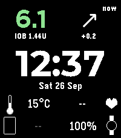
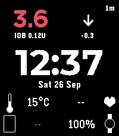
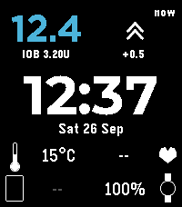

# Islet

**An AndroidAPS watchface for the Pebble Time 2.** Glucose, trend, delta and insulin on board come straight from AndroidAPS on your phone. No Nightscout, no xDrip+ and no internet connection are needed for the diabetes data.

<p>
  
  
  
</p>

---

## What it shows

| Where | What | Source |
|---|---|---|
| Top left | Glucose value, coloured low / in range / high | AndroidAPS |
| Under glucose | Insulin on board, e.g. `IOB 1.44U` | AndroidAPS |
| Top right | Time since the last reading, trend arrow, delta | AndroidAPS |
| Middle | Time and date (English or Nynorsk) | Watch |
| Lower left | Temperature where you are | Open-Meteo, via your phone's location |
| Lower right | Heart rate | Pebble Health |
| Bottom | Phone battery and watch battery | Pebble app / watch |

- Glucose is shown in whatever unit AndroidAPS uses (mmol/L or mg/dL).
- Colours switch at 4.0 / 10.0 mmol/L (70 / 180 mg/dL). The colours themselves can be changed in the settings.
- IOB turns grey (`IOB --`) if it hasn't been updated for 15 minutes, so a stale value never looks current.
- The watch asks the phone for fresh data every minute.

## How it works

```
Libre / Dexcom / … ──▶ AndroidAPS ──HTTP on 127.0.0.1:28891──▶ Pebble app (PebbleKit JS) ──Bluetooth──▶ watch
```

AndroidAPS has a small built-in web server, part of its **Garmin** plugin, that only apps on the same phone can reach. Islet's phone-side script asks it for the latest reading once a minute and sends the result to the watch. Everything stays on your phone.

---

## Setup

You need:

- A **Pebble Time 2** (the only supported model for now)
- An Android phone running **AndroidAPS** and the **Pebble app** from Core Devices

### 1. Turn on AndroidAPS's local web server

1. Open AndroidAPS → **Config Builder**.
2. Under **Synchronization**, tick **Garmin**. You don't need a Garmin watch; this only turns on the web server.
3. Open the Garmin plugin's settings (the cog next to it) and turn on **Local HTTP server**.
4. Leave the port at **28891**.

To check it works, open `http://127.0.0.1:28891/sgv.json?count=1` in a browser **on the phone**. You should see your latest reading as JSON.

### 2. Install Islet

Install **[Islet for AndroidAPS](https://apps.rePebble.com/a5543813bd14472f90ff7542)** from the Pebble app store (search for "Islet" or "AndroidAPS" in the Pebble app). Or download `islet.pbw` from [Releases](../../releases) and open it with the Pebble app.

### 3. Turn off other senders

If xDrip+ or another app is set to send glucose to your Pebble, turn that off. Islet fetches its own data.

### 4. Optional settings

Open Islet's settings in the Pebble app:

| Setting | Default | What it does |
|---|---|---|
| Display seconds in time | Off | Shows `HH:MM:SS`. Uses more battery. |
| Repeat alert vibrations every 15 minutes | On | Repeats the vibration while the watch is disconnected from the phone |
| Silence all vibrations | Off | No vibrations from the watchface at all |
| Backlight on when charging | Off | Keeps the light on while the watch charges |
| Glucose colors | Red / green / blue | Colours for low, in range and high |
| Dato på nynorsk | Off | Date in Nynorsk instead of English |

The location permission is only used for the weather.

---

## Troubleshooting

| You see | Likely cause | Fix |
|---|---|---|
| `---` instead of glucose | The phone can't reach AndroidAPS | Check step 1, and that AndroidAPS is running. Open the URL above on the phone. |
| `IOB --` in grey | No IOB for 15 minutes | Same as above. Also check the Pebble app is running in the background and battery optimisation is off for it. |
| Reading age keeps growing | AndroidAPS has no new CGM data | Check your CGM app and AndroidAPS itself |
| Phone battery `--` | The phone didn't report its battery level | Nothing to fix. Everything else still works. |

For more detail, run `pebble logs --phone <PHONE_IP>` with the Pebble app's developer connection turned on. Every fetch is logged.

---

## Building from source

Requires the [Pebble SDK](https://developer.repebble.com/sdk/) (4.9 or newer) and Node.js.

```bash
npm install
pebble build                          # → build/islet-pebble.pbw
pebble install --emulator emery       # try it in the emulator
pebble install --phone <PHONE_IP>     # install on your watch (developer connection)
```

In the emulator, the phone-side script runs on your computer. So `127.0.0.1:28891` means your computer, and you can serve test data there:

```bash
python3 -c '
import http.server, json, time
class H(http.server.BaseHTTPRequestHandler):
    def do_GET(self):
        self.send_response(200); self.end_headers()
        self.wfile.write(json.dumps([{"date": int(time.time()*1000), "sgv": 110, "delta": 3.6,
            "direction": "FortyFiveUp", "units_hint": "mmol", "iob": 1.44}]).encode())
http.server.HTTPServer(("127.0.0.1", 28891), H).serve_forever()'
```

### Project layout

| Path | What |
|---|---|
| `src/c/main.c` | Watch side: layout, drawing, message handling |
| `src/js/index.js` | Phone side: fetches from AndroidAPS, weather and phone battery |
| `src/js/config.json` | Settings page (Clay) |
| `resources/` | Montserrat Bold for the clock |

### Messages from phone to watch

| Key | Name | Type | Meaning |
|---|---|---|---|
| 0 | `icon` | string | Trend arrow: `1` ⇈, `2` ↑, `3` ↗, `4` →, `5` ↘, `6` ↓, `7` ⇊, `0` none |
| 1 | `bg` | string | Glucose, already formatted (`"6.1"` or `"110"`) |
| 2 | `tcgm` | uint32 | Reading time, Unix seconds (UTC) |
| 4 | `dlta` | string | Delta, formatted (`"+0.2"`) |
| 5 | `ubat` | string | Phone battery % |
| 13 | `iob` | string | Insulin on board (`"1.44"`) |
| 14 | `iob_time` | uint32 | When the IOB was read, Unix seconds (UTC) |
| 200 | `weather_temp` | int32 | Temperature, °C |
| 1000 | `sync` | — | Watch → phone: "send fresh data" (every minute) |

---

## Credits

- The layout started as a redesign of [xDrip-Pebble-E](https://github.com/jstevensog/xDrip-Pebble-E), which descends from the Nightscout community's [cgm-pebble](https://github.com/nightscout/cgm-pebble).
- Clock font: [Montserrat](https://github.com/JulietaUla/Montserrat), SIL Open Font License 1.1 (`resources/Montserrat-OFL.txt`).
- Weather: [Open-Meteo](https://open-meteo.com/).
- Data: [AndroidAPS](https://github.com/nightscout/AndroidAPS), through its Garmin plugin's local HTTP server.

## License

MIT, see [LICENSE](LICENSE). The Montserrat font is under the SIL Open Font License 1.1.
